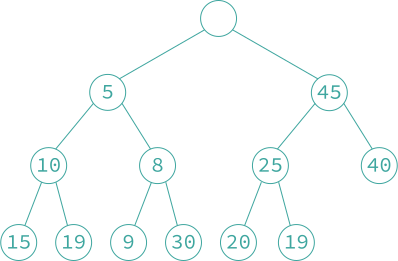
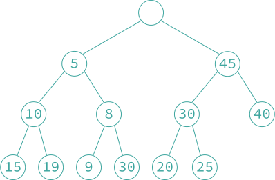

### 9.2 双端堆

- **「双端堆 deap, double-ended heap」** 是支持双端优先队列的插入、删除最小元素和删除最大元素等操作的堆。其比最小-最大堆上的相应操作还要快一个常数因子，而且算法更加简单。双端堆是一棵完全二叉树，该完全二叉树要么为空，要么同时满足下列性质：
  1. 根结点不包含元素。
  2. 左子树是一个最小堆。
  3. 右子树是一个最大堆。
  4. 如果右子树不空，则令 $$i$$ 是左子树中任意一个结点，$$j$$ 是 $$i$$ 在右子树中的对应结点。如果 $$i$$ 在右子树中的对应结点 $$j$$ 不存在，则令 $$j$$ 为 $$i$$ 的父结点在右子树中的对应结点。对于结点 $$i$$ 和 $$j$$，结点 $$i$$ 的关键字值小于等于结点 $$j$$ 的关键字值。即 $$j = i + 2^{\lfloor \log_2i\rfloor -1}$$；如果 $$(j > n)$$，则 $$j /= 2$$。


<div align="center">
    <p style="color:#3ea69f">
    双端堆
    </p>
</div>

- **『插入操作』** 假设要在上图所示的堆中插入关键字值为 4 的元素，新结点的位置在下图中的 $$j$$ 结点的位置。插入过程首先把关键字值 4 与 $$j$$ 在最小堆中的对应结点 $$i$$ 的关键字值进行比较，此处结点 $$i$$ 包含关键字值 19。由于 4 < 19，则将关键字值为 19 的元素移到结点 $$j$$ 中，移动后右边的最大堆的性质保持不变，不需要进行调整。现在只需利用最小堆的插入算法将 4 插入最小堆中的位置并进行调整（如下面第二张图）。若插入的关键字值为 30 的元素，由于 19 < 30，只需利用最大堆的插入算法将 30 插入到最大堆中位置 $$j$$ 并进行调整（如下面第三张图）。




<div align="center">
    <p style="color:#3ea69f">
    插入 4 后的双端堆
    </p>
</div>



<div align="center">
    <p style="color:#3ea69f">
    插入 30 后的双端堆
    </p>
</div>

函数 `deap_insert` 实现了插入的过程。其时间复杂度为 $$O(\log n)$$。此函数调用了下面的函数：

1. `max_heap(n)` 该函数将返回 `true` 当且仅当 `n` 位于双端堆中的最大堆中。
2. `min_partner(n)` 该函数计算最大堆结点 `n` 对应的最小堆结点。这可以由 $$n-2^{\lfloor \log_2n\rfloor -1}$$ 确定。
3. `max_partner(n)` 该函数计算最小堆结点 `n` 的父结点对应的最大堆结点。这可以由 $$(n+2^{\lfloor \log_2n\rfloor -1})/2$$ 确定。
4. `min_insert` 和 `max_insert` 这两个函数分别将一个元素插入最小堆和最大堆中的指定位置。插入过程是在相应的堆中沿着指定位置到根结点的路径进行比较，必要时将相关元素下移，直到找到插入新元素的正确位置为止。

```c++
void deap_insert(element deap[], int *n, element x)
{
    int i;
    (*n) ++;
    if (*n == MAX_SIZE) {
        fprintf(stderr, "The heap is full\n");
        exit(1);
    }
    if (*n == 2)
        deap[2] = x;
    else switch (max_heap(*n)) {
        case false:
            i = max_partner(*n);
            if (x.key > deap[i].key) {
                deap[*n] = deap[i];
                max_insert(deap, i, x);
            }
            else
                min_insert(deap, *n, x);
            break;
        case true:
            i = min_partner(*n);
            if (x.key < deap[i].key) {
                deap[*n] = deap[i];
                min_insert(deap, i, x);
            }
            else
                max_insert(deap, *n, x);
    }
}
```

- **『删除最小元素操作』** 首先删除最小堆的根结点，即删除最小的元素。然后将下标最大的元素删除，即删除最后一个元素。然后沿着最小堆的根结点向下寻找最小的儿子结点依次补位其父亲结点。函数 `deap_delete_min` 完成了这种操作，其中函数 `modified_deap_insert` 与 `deap_insert` 不同的是插入操作仅在最小堆中进行。由于双端堆的高度是 $$O(\log n)$$，所以，函数的时间复杂度是 $$O(\log n)$$。

```c++
element deap_delete_min(element deap[], int *n)
{
    int i, j;
    element temp;
    if (*n < 2) {
        fprintf(stderr, "The deap is empty\n");
        deap[0].key = INT_MAX;
        return deap[0];
    }
    deap[0] = deap[2];
    temp = deap[(*n)--];
    for (i = 2; i*2 <= *n; deap[i] = deap[j], i = j) {
        j = i * 2;
        if (j+1 <= *n) {
            if (deap[j].key > deap[j+1].key)
                j++;
        }
    }
    modified_deap_insert(deap, i, temp);
    return deap[0];
}
```

例如，将本节第一张图的双端堆执行删除最小元素的操作，先删除最小堆的根结点，即关键字值为 5 的结点，然后将最后一个元素（关键字值为 20）暂存到临时变量 `temp` 中。其次，填充由于删除最小元素而在最小堆根结点产生的空位。选取当前结点的儿子结点中关键字值较小的元素移到当前结点，即将关键字值为 8 的结点移到最小堆根结点，然后将关键字值为 9 的结点填充其父结点的空位。此时，最小堆的叶子结点形成一个空位，将 20 插入这个空的叶结点。把关键字值 20 与其在最大堆中的对应结点的关键字值 40 进行比较，由于 20 < 40，所以不需进行交换。如下图为删除后的双端堆。


> 删除最大元素操作 `deap_delete_max` 与删除最小元素操作 `deap_delete_min` 类似。
