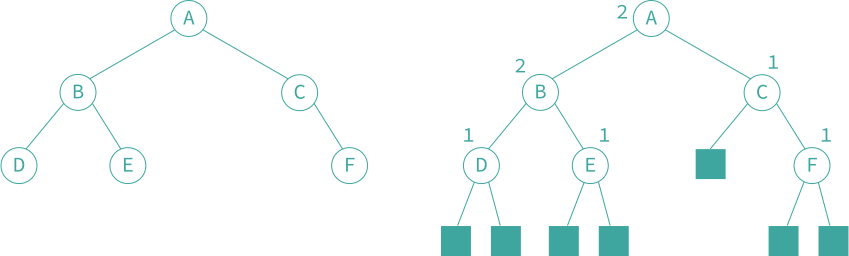

### 9.3 左高树

9.1 和 9.2 的堆结构存储优先队列在执行「合并 combine」操作的时间开销为 $$O(n)$$。研究一种左高树存储优先队列，使得其可以在对数时间执行合并操作。

- **「扩充二叉树 extended binary tree」** 是一棵二叉树，其所有的空子树都由方形结点代替。如下图分别为一棵二叉树和一棵对应的扩充二叉树。
- 在扩充二叉树中，方形结点称为 **「外部结点 external node」**，原来的（圆形）结点称为 **「内部结点 internal node」**。



设 $$x$$ 是扩充二叉树的一个结点，并令 $$left\_child(x)$$ 和 $$right\_child(x)$$ 分别表示内部结点 $$x$$ 的左、右儿子。定义 $$shortest(x)$$ 为从 $$x$$ 到一个外部结点的最短路径的长度，则容易得到 $$shortest(x)$$ 满足下面的递归关系：
$$
shortest(x) = 
\begin{cases}
    0, & \mathrm{if}\ x\ \mathrm{is\ external\ node} \\
    1 + min\{shortest(left\_child(x)), shortest(right\_child(x))\}, &\mathrm{other}
\end{cases}
$$
上图扩充二叉树结点旁的数字是该结点的 $$shortest(x)$$ 值。

- **「左高树 leftist tree」** 是一棵二叉树，且如果该二叉树不为空，则对于其中的每个内部结点 $$x$$，都有：$$shortest(left\_child(x)) \geq shortest(right\_child(x))$$。上图的扩充二叉树不是左高树，因为 $$shortest(left\_child(C)) < shortest(right\_child(C))$$。设 $$x$$ 为一个具有 $$n$$ 个（内部）结点的左高树的根，则：
  1. $$n \geq 2^{shortest(x)}-1$$；
  2. 由根到所有外部结点路径中，沿根向下最右边的那条路径是最短的，其长度为 $$shortest(x)$$。

- **「最小（最大）左高树」** 是一棵左高树，其中每个内部结点的关键字值都不大于（不小于）该结点的儿子结点（如果有的话）的关键字值。换句话说，一棵最小（最大）左高树既是一棵左高树，同时又是一个最小（最大）树。如下图的两棵树均为最小左高树。


插入操作和删除最小元素操作都可以通过合并操作实现。要把元素 $$x$$ 插入到一棵最小左高树 $$a$$，首先建立一棵只包含单个元素 $$x$$ 的最小左高树 $$b$$；然后，合并这两棵最小左高树 $$a$$ 和 $$b$$。要从一棵非空最小左高树 $$a$$ 中删除最小元素，首先合并最小左高树 $$a$$ 的左子树和右子树，然后删除结点 $$a$$。

作为一个例子，考虑合并上图两棵最小左高树 $$a$$ 和 $$b$$。首先比较两个根结点的关键字值 2 和 5。因为 2 < 5，所以新的二叉树的根结点为 2。然后保留 $$a$$ 的左子树不变，而将其右子树与最小左高树 $$b$$ 合并。合并后的二叉树成为新的 $$a$$ 的右子树。在合并 $$a$$ 的右子树与二叉树 $$b$$ 时，由于 5 < 50，所以 5 将成为合并后的树根结点。现在，继续合并以 8 和 50 为根的子树，由于 8 < 50，且 8 没有右子树，可以把以 50 为根的子树作为结点 8 的右子树，得到下图 a) 所示的二叉树。因此，合并 $$a$$ 的右子树与二叉树 $$b$$ 的结果二叉树如图 b) 所示。该树成为 $$a$$ 的右子树，从而得到了如图 c) 所示的二叉树。为了将这棵二叉树转化成左高树，从最后一个修改结点（即 8）开始，回溯到最终的树根结点，使得路径上的所有结点满足不等式：$$shortest(left\_child()) \geq shortest(right\_child())$$。对于结点 8，该不等式成立，但对于结点 5 和 2，这个不等式不成立。此时，只要简单地交换这些结点的左、右子树，就使上述不等式成立。最终的左高树如图 d) 所示。


函数 `min_combine` 是合并两棵左高树的程序。该函数调用函数 `min_union` 来实际地合并两棵非空最小左高树。函数 `min_union` 递归地执行如下两个步骤的操作：
1. 建立一棵包含所有元素的二叉树，同时保证每颗子树中的根结点关键字是最小的。
2. 是每个结点的左子树的 `shortest` 值大于等于其右子树的 `shortest` 值。

```c++
typedef struct leftist *leftist_tree;
struct leftist {
    leftist_tree left_child;
    element data;
    leftist_tree right_child;
    int shortest;
};
```

```c++
void min_combine(leftist_tree *a, leftist_tree *b)
{
    if (!*a)
        *a = *b;
    else if (*b)
        min_union(a, b);
    *b = NULL;
}
```

```c++
void min_union(leftist_tree *a, leftist_tree *b)
{
    if ((*a) -> data.key > (*b) -> data.key)
        SWAP(*a, *b, temp);
    if (!(*a) -> right_child)
        (*a) -> right_child = *b;
    else
        min_union(&(*a)->right_child, b);
    // 左高树的性质
    if (!(*a) -> left_child) {
        (*a) -> left_child = (*a) -> right_child;
        (*a) -> right_child = NULL;
    }
    else if ((*a) -> left_child -> shortest < (*a) -> right_child -> shortest)
        SWAP((*a) -> left_child, (*a) -> right_child, temp);
    (*a) -> shortest = (!(*a) -> right_child) ? 1 : (*a) -> right_child -> shortest + 1;
}
```
