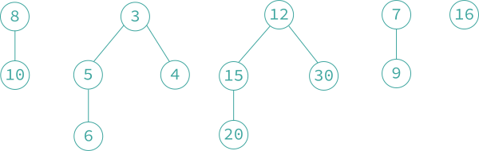
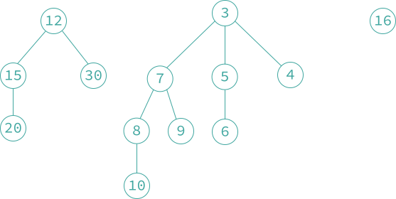

### 9.4 二项堆

- **「二项堆 binomial heap」** 是一种与左高树支持相同的操作的数据结构，但二项堆的一次单独的操作可能需要 $$O(n)$$ 时间。但是，如果将时间复杂度高的操作分摊到时间复杂度低的操作上，那么每个操作的 「分摊复杂性 amortized compexity」 是 $$O(1)$$ 或 $$O(\log n)$$。
- **「最小二项堆 min-binomial heap」** 是最小二项树的集合，**「最大二项堆 max-binomial heap」** 是最大二项堆的集合。二项堆简称 「B 堆」。

> **「二项树」** 是一种递归定义的有序树，二项树递归定义如下：
> 1. 度数为 0 的二项树只包含一个结点。
> 2. 度数为 $$k$$ 的二项树有一个根结点，根结点下有 $$k$$ 个子女，每个子女分别是度数分别为 $$k-1, k-2, \cdots, 2, 1, 0$$ 的二项树的根。

    

    具有三棵最小二项树的 B 堆
    

对于 B 堆的存储表示，其结点结构包含如下 5 个域：`degree`, `child`, `left_link`, `right_link`, `data`。其中 `degree` 域表示该结点的儿子个数；`child` 域用来指向该结点的某个儿子（如果存在的话）；`left_link` 域和 `right_link` 域用来维护由兄弟结点组成的双向循环链表。一个结点的所有儿子形成一个双向循环链表，而该结点的 `child` 域指向其中的一个儿子。此外，构成 B 堆的所有最小二项树的根也链接成一个双向循环链表。于是，B 堆由一个指向具有最小关键字值的最小二项树的根结点的指针来表示。

- **『插入操作』** 把元素 $$x$$ 插入到 B 堆 $$a$$ 的过程是：首先将 $$x$$ 存入一个新结点，然后，将该结点插入由 $$a$$ 指向的双向循环链表。如果 $$a$$ 为 `NULL` 或者 $$x$$ 的关键字值小于 $$a$$ 所指向结点的关键字值，则令指针 $$a$$ 指向新结点。显然，执行插入操作可以在 $$O(1)$$ 时间内完成。
- **『合并操作』** 为了合并两个非空 B 堆 $$a$$ 和 $$b$$，可以把两个 B 堆 $$a$$ 和 $$b$$ 顶层的两个双向循环链表合并成一个双向循环链表。新的 B 堆指针指向 B 堆 $$a$$，还是 B 堆 $$b$$，取决于 $$a$$ 和 $$b$$ 所指向的结点关键字值哪个更小。显然合并操作也可以在 $$O(1)$$ 时间内完成。
- **『删除最小元素操作』** 从 B 堆 $$a$$ 中删除最小元素，返回这个最小元素 $$x$$。此操作的分摊代价是 $$O(\log n)$$。
  1. [处理空的 B 堆] `if(a == NULL) 返回错误 else 执行 2-4 步;`
  2. [从非空 B 堆中删除元素] `x = a -> data; y = a -> child;` 从 $$a$$ 所在双向循环链表中删除结点 $$a$$；此时，$$a$$ 将指向该链表中任何一个剩余结点；如果该链表中没有这样的结点，则 `a = NULL;`
  3. [最小二项树的连接] 考察链表 $$a$$ 和 $$y$$ 中的最小二项树反复连接相同度的最小二项树对，直到所有剩余的任意最小二项树的度互不相同为止；
  4. [形成最小二项树的根结点链表] 链表所有剩余的最小二项树（如果存在）的根形成一个双向循环链表；设定 $$a$$ 指向其中关键字值最小的根结点（如果存在）。

    

    从上图的 B 堆删除最小元素后的情形
    

    

    连接两个度为 1 的最小二项树后
    

    

    连接两个度为 2 的最小二项树后
    

