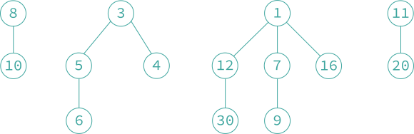

### 9.5 斐波那契堆

- **「斐波那契堆 Fibonacci heap」** 是一种数据结构，除了支持二项堆的插入、删除最小（大）元素和合并三种操作以外，还支持下列新操作：
  1. 「删除操作 delete」，删除指定结点的元素。分摊时间复杂度为 $$O(1)$$。
  2. 「关键字减值操作 decrease key」，将指定结点的关键字值减去一个正数值。分摊时间复杂度为 $$O(1)$$。

- **「最小斐波那契堆 min-Fibonacci heap」** 是最小树的集合，**「最大斐波那契堆 max-Fibonacci heap」** 是最大堆的集合。
- 斐波那契堆简称 F 堆，B 堆是 F 堆的一种特殊情况。F 堆的存储表示在 B 堆的基础上增加两个域：`parent` 域和 `child_cut` 域。其中 `parent` 域用于指向该结点的父结点（如果该结点有父结点），而 `child_cut` 域的含义在下面「级联剪枝操作」中进行介绍。插入、删除最小（大）元素和合并这三个基本操作的实现与 B 堆上相应的操作完全相同。
- **『删除操作』** 为了从 F 堆上删除任意一个结点 $$b$$，执行如下操作步骤：
  1. 若 $$a = b$$，则执行删除最小元素操作；否则执行 2-4 步；
  2. 将 $$b$$ 从其所在的双向链表中删除；
  3. 将 $$b$$ 儿子结点形成的双向链表与 $$a$$ 所指向的根结点形成的双向链表合并，形成一个新的根结点双向链表。与删除最小元素不同的是，此处不连接相同度的树；
  4. 释放结点 $$b$$。

    

    原 F 堆
    

    

    原 F 堆删除 12 后的 F 堆
    

- **『关键字减值操作』** 为了减小结点 $$b$$ 中的关键字值，执行以下操作步骤：
  1. 减小结点 $$b$$ 中的关键字值；
  2. 如果结点 $$b$$ 不是最小树的根结点，且关键字值小于其父结点关键字值，那么，将 $$b$$ 从其所在的双向链表中删除，并将其插入到由最小树根结点形成的双向链表中；
  3. 若结点 $$b$$ 的关键字值小于结点 $$a$$ 的关键字值，将 $$a$$ 指向 $$b$$。

    

    原 F 堆关键字 15 减 4 后的 F 堆
    

- **『级联剪枝操作』**
