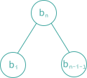

### 5.11 二叉树计数

考虑三个问题：

- **『确定具有 $$n$$ 个结点的不同二叉树的个数』**

如果 $$n = 0$$ 或 $$1$$，则只存在一棵二叉树。如果 $$n = 2$$，则存在两棵不同的二叉树，而如果 $$n = 3$$，则存在 5 棵不同的二叉树……

- **『将 $$1, 2, 3, ..., n$$ 这 $$n$$ 个数依次入栈，并通过栈以可能的方式得到的不同的排列为？』**

考虑一棵二叉树的前序序列：
$$
1\ 2\ 3\ 4\ 5\ 6\ 7\ 8\ 9
$$
和中序序列：
$$
2\ 3\ 1\ 5\ 4\ 7\ 8\ 6\ 9
$$
则可以唯一地确定这棵树：

    

倘若现在固定前序排列，从前序排列为 $$1, 2, ..., n$$ 的二叉树得到的不同的中序排列个数就等于不同的二叉树个数。

考虑 $$n = 3$$，将 $$1, 2, 3$$ 依次进栈，以所有可能的方式出栈得到的不同排列为：
$$
(1, 2, 3)\ (1, 3, 2)\ (2, 1, 3)\ (2, 3, 1)\ (3, 2, 1)
$$
即：
1. $$1$$ 进 -> $$1$$ 出 -> $$2$$ 进 -> $$2$$ 出 -> $$3$$ 进 -> $$3$$ 出
2. $$1$$ 进 -> $$1$$ 出 -> $$2$$ 进 -> $$3$$ 进 -> $$3$$ 出 -> $$2$$ 出
3. $$1$$ 进 -> $$2$$ 进 -> $$2$$ 出 -> $$1$$ 出 -> $$3$$ 进 -> $$3$$ 出
4. $$1$$ 进 -> $$2$$ 进 -> $$2$$ 出 -> $$3$$ 进 -> $$3$$ 出 -> $$1$$ 出
5. $$1$$ 进 -> $$2$$ 进 -> $$3$$ 进 -> $$3$$ 出 -> $$2$$ 出 -> $$1$$ 出

无论怎样出栈入栈，都不可能得到 $$(3, 1, 2)$$ 排列。这 5 种排列中的每一个都对应于具有三个结点的 5 个不同的二叉树中的一个。

- **『$$n + 1$$ 个矩阵相乘的不同方法数』**

假设要计算下面的 $$n$$ 个矩阵的乘积：
$$
M_1 * M_2 * \cdots * M_n
$$
由于矩阵乘法满足结合律，因此，可以按任意的顺序执行矩阵乘法操作。如果 $$n = 3$$，那么有如下两种可能的结合方法：
$$
(M_1 * M_2) * M_3
$$
$$
M_1 * (M_2 * M_3)
$$
如果 $$n = 4$$，则有以下五种可能的结合方法：
$$
((M_1 * M_2) * M_3) * M_4
$$
$$
(M_1 * (M_2 * M_3)) * M_4
$$
$$
M_1 * ((M_2 * M_3) * M_4)
$$
$$
M_1 * (M_2 * (M_3 * M_4))
$$
$$
(M_1 * M_2) * (M_3 * M_4)
$$
令 $$b_n$$ 是计算 $$n$$ 个矩阵乘积不同的方法数。那么 $$b_2 = 1$$，$$b_3 = 2$$，$$b_4 = 5$$。令 $$M_{ij}, i \leq j$$ 为矩阵 $$M_i * M_{i+1} * \cdots * M_j$$ 的乘积。如果要计算的乘积是 $$M_{1n}$$，可以通过计算任何的 $$M_{1i} * M_{i+1, n}(1 \leq i \leq n)$$ 来计算 $$M_{1n}$$。由于计算 $$M_{1i}$$ 和 $$M_{i+1, n}$$ 的不同结合的方法数分别为 $$b_i$$ 和 $$b_{n-i}$$。因此，令 $$b_1 = 1$$，有：
$$
b_n = \sum_{i=1}^{n-1}b_ib_{n-i},\ n>1
$$
如果能够唯一确定 $$b_n$$ 的关于 $$n$$ 的表达式，那么就得到问题的解。

现在令 $$b_n$$ 为具有 $$n$$ 个结点的不同的二叉树的个数。且 $$b_n$$ 是所有可能的二叉树的个数，这些二叉树都是按如下方式形成的：一个根结点和两棵结点个数分别为 $$b_i$$ 和 $$b_{n-i-1}$$ 的子树，其中 $$0 \leq i < n$$。如下图。

    

所以，
$$
b_n = \sum_{i=0}^{n-1}b_ib_{n-i-1}, \ n \geq 1, \ \mathrm{and} \ b_0 = 1
$$
这个公式和前一个公式在本质上是相同的。因此，具有 $$n$$ 个结点的二叉树的个数，用栈得到的 $$1$$ 到 $$n$$ 的排列个数和 $$n + 1$$ 个矩阵乘法的结合方法数是相等的。

因此，以上三个问题都有相同的答案。

- **『结果』**

令
$$
B(x) = \sum_{i \geq 0} b_ix^i
$$
这是计算二叉树个数的生成函数。其次，由递归关系得到的等式：
$$
xB^2(x) = B(x) - 1
$$
根据这个公式来解一元二次方程，并注意 $$B(0) = b_0 = 1$$ 得：
$$
B(x) = \frac{1 - \sqrt{1 - 4x}}{2x}
$$
使用二项式定理展开 $$(1-4x)^{1/2}$$，得到：
$$
\begin{aligned}
    B(x) & = \frac{1}{2x}\left[1 - \sum_{n \geq 0}\binom{1/2}{n}(-4x)^n \right] \\
    & = \sum_{m \geq 0} \binom{1/2}{n+1}(-1)^m2^{2m+1}x^m
\end{aligned}
$$
与第一个方程相比，可以看出，在 $$B(x)$$ 中的 $$x^n$$ 的系数 $$b_n$$ 是：
$$
\binom{1/2}{n+1}(-1)^n2^{2n+1}
$$
化简得：
$$
b_n = \frac{1}{n+1}\binom{2n}{n}
$$
该值近似为：
$$
b_n = O(4^n/n^{3/2})
$$
.
