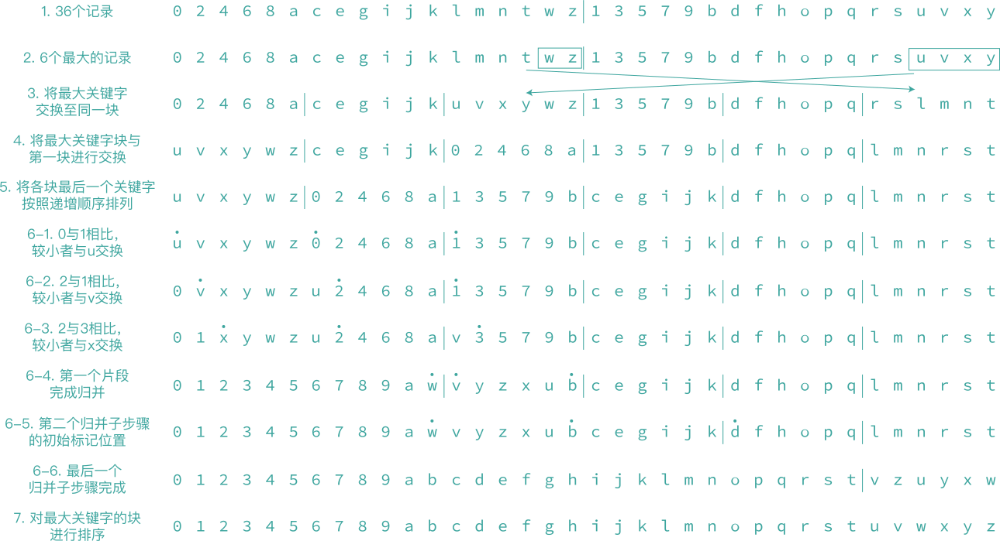

### 7.6 归并排序

- **『归并』**

第一种归并算法，它非常简单且空间复杂度为 $$O(n)$$。它把已排序的表 (`list[i]`, $$\cdots$$ , `list[m]`) 和 (`list[m + 1]`, $$\cdots$$ , `list[n]`) 归并为一个有序表 (`sorted[i]`, $$\cdots$$ , `sorted[n]`)。

```c++
void merge(element lsit[], element sorted[], int i, int m, int n)
{
    int j, k, t;
    j = m + 1;
    k = i;
    while (i <= m && j <= n) {
        if (list[i].key <= list[j].key)
            sorted[k++] = list[i++];
        else
            sorted[k++] = list[j++];
    }
    if (i > m)
        for (t = j; t <= n; t++)
            sorted[k+t-j] = list[t];
    else
        for (t = i; t <= m; t++)
            sorted[k+t-i] = list[t];
}
```

第二种归并算法较为复杂，其时间复杂度为 $$O(n)$$，但其空间复杂度仅为 $$O(1)$$。

假定 $$n$$ 为完全平方数，为 36。每个待归并的有序表的记录个数必须为 $$\sqrt{n}$$ 的倍数：包含 18 个记录。下图中的第一行给出了待归并的 36 个关键字，假定排序后的关键字序列为下图最后一行的有序表。归并算法步骤如下：

1. 从左到右扫描两个待归并表，确定 $$\sqrt{n}$$ 个最大关键字。如下图序号为 2 的行。确定 w, z, u, v, x, y 为最大的 6 个关键字。
2. 将第二个待归并表中的最大关键字与第一个待归并表中的最大关键字之前的记录进行交换，从而使得这 $$\sqrt{n}$$ 个最大关键字的记录形成一个连续的块。如下图序号为 3 的行。
3. 把这 $$\sqrt{n}$$ 个关键字组成的块与第一块（即最左边的块）进行交换（除了已经在最左边的情况），并排序最右边的块。如下图序号为 4 的行。
4. 将所有块（最大关键字的块除外），按照各块最后一个关键字递增顺序，排列各块。如下图序号为 5 的行。
5. 重复执行归并子步骤，将除了最大关键字的块以外的块进行归并。归并子步骤如下：
   1. 每个子步骤有两个记录片段需要归并，初始时，第一个记录片段是从第二块开始的最长有序序列，它们是 0, 2, 4, 6, 8, a；第二个记录片段开始于下一段的第一个关键字： 1。如下图序号为 6-1 的行。行中有三个标记点，第二个标记点与第三个标记点分别代指第一个记录片段与第二个记录片段的第一个关键字。第一个标记点用来标记下一个归并记录将要存放的位置。接下来比较第二个标记点与第三个标记点所指向的关键字，再将其中较小的关键字与第一个标记所指向的记录交换。此处为 u 与 0 交换。
   2. 如下图序号为 6-2 的行为完成了第一次交换后的情况。6-3 为完成了第二次交换后的情况。6-4 为第一个片段全部归并后的情形。
   3. 当第一个记录片段完成归并之后。第一个记录片段的起始点（即第二个标记点），将其作为第三个标记点的位置。第一个记录片段的长度为从此标记点开始的最长有序片段，即 b, c, e, g, i, j, k。而第三个标记点的标记位置则为 d。如下图序号为 6-5 的行。
   4. 继续归并，并重复步骤 3，直到归并结束，如下图序号为 6-6 的行。
6. 子步骤完成后，最后对最大关键字的块进行排序。如下图序号为 7 的行。



- **『归并排序的迭代算法』** 如果将输入序列看成是 $$n$$ 个已排序序列，其中每个序列的长度为 1。将这些序列两两归并就得到了 $$n/2$$ 个长度为 2 的序列（如果 $$n$$ 为奇数，则有一个序列长度为 1）。然后对这 $$n/2$$ 个序列进行两两归并，以此类推，直到剩下一个序列为止。下面函数 `merge_pass` 为执行单遍归并的函数，程序中调用了前面的函数 `merge`。函数 `merge_sort` 为完成排序的函数。

```c++
void merge_pass(element list[], element sorted[], int n, int length)
{
    int i, j;
    for (i = 0; i <= n - 2 * length; i += 2 * length)
        merge(list, sorted, i, i + length - 1, i + 2 * length - 1);
    if (i + length < n)
        merge(list, sorted, i, i + length - 1, n - 1);
    else
        for (j = i; j < n; j++)
            sorted[j] = list[j];
}
```

```c++
void merge_sort(element list[], int n)
{
    int length = 1;
    element extra[MAX_SIZE];

    while (length < n) {
        merge_pass(list, extra, n, length);
        length *= 2;
        merge_pass(extra, list, n, length);
        length *= 2;
    }
}
```

该函数总的归并遍数为 $$\lceil \log_2n \rceil$$，且每遍归并的时间开销为 $$O(n)$$。所以总的计算时间是 $$O(n\log n)$$。


<p style="color:#3ea69f" align="center">
归并 [26,5,77,1,61,11,59,15,48,19] 的迭代算法归并树
</p>

- **『归并排序的递归算法』** 在递归算法中，记录的结构修改为链表，每个记录定义为 `key` 域和 `link` 域。初始化时，`list[i].link = -1`，以下函数 `rmerge` 实现整个 `list` 的排序算法，返回一个已排序序列的起始位置，调用方法为 `start = rmerge(list, 0, n-1)`。而函数 `listmerge` 是归并两个已排序的链表，它输入两个已排序链表的起始位置。

```c++
int rmerge(element list[], int lower, int upper)
{
    int middle;
    if (lower >= upper)
        return lower;
    else {
        middle = (lower + upper) / 2;
        return listmerge(list, rmerge(list, lower, middle), rmerge(list, middle+1, upper));
    }
}
```

```c++
int listmerge(element list[], int first, int second)
{
    int start = n;
    while (first != -1 && second != -1) {
        if (list[first].key <= list[second].key) {
            list[start].link = first;
            start = first;
            first = list[first].link;
        }
        else {
            list[start].link = second;
            start = second;
            first = list[second].link;
        }
    }
    if (first == -1)
        list[start].link = second;
    else
        list[start].link = first;
    return list[n].link;
}
```


<p style="color:#3ea69f" align="center">
归并 [26,5,77,1,61,11,59,15,48,19] 的递归算法归并树
</p>

排序完成的 `start` 值、各个 `key` 域和 `link` 域的值：

`start = 3`

i | 0 | 1 | 2 | 3 | 4 | 5 | 6 | 7 | 8 | 9
:-: | :-: | :-: | :-: | :-: | :-: | :-: | :-: | :-: | :-: | :-:
`key` | 26 | 5 | 77 | 1 | 61 | 11 | 59 | 15 | 48 | 19
`link` | 8 | 5 | -1 | 1 | 2 | 7 | 4 | 9 | 6 | 0

> **算法变形：自然归并排序**
> 
> 可以把输入序列已有的顺序考虑进去，实现时，先将输入序列扫描一遍，确定出已经按顺序排列的序列，然后再进行归并排序：
> 
> 
